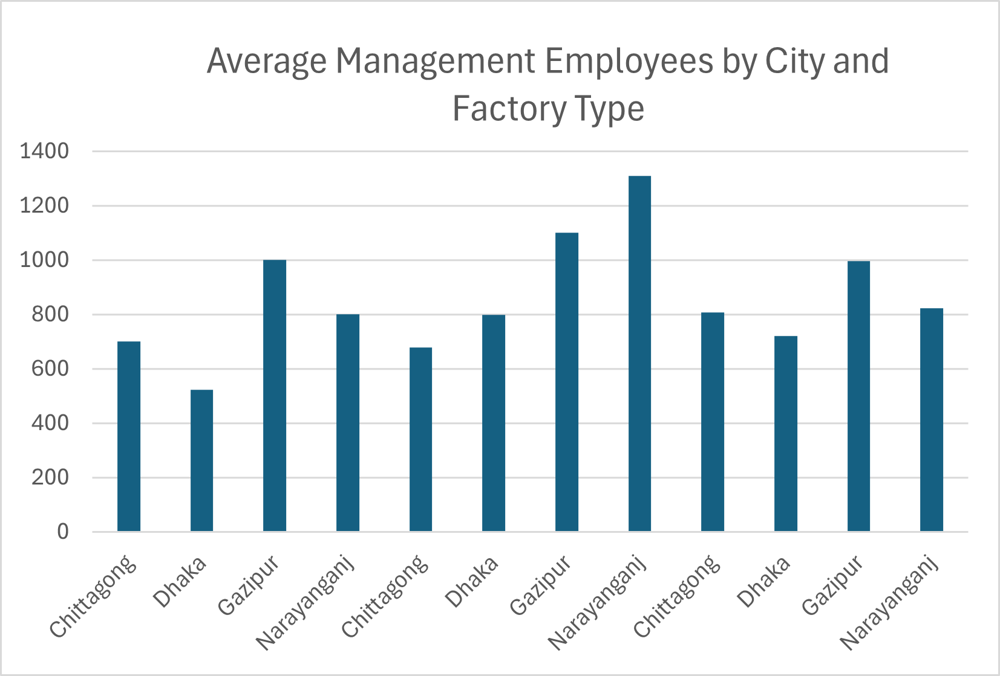

Bangladesh Garment Factory Analysis

I worked with a BGMEA-listed dataset of ~3,763 garment factories across Bangladesh, covering factory type, employee counts, location, and production details.

Before analysis, I found significant data quality issues: 72 factories had blank factory_type entries where the city field also contained full street addresses instead of city names — these were excluded from city-level analysis. The factiry_location_in_city column itself contained dozens of one-off full addresses mixed in with real city names, so I filtered the analysis to only include cities backed by at least 5 factories, to avoid misleading averages from tiny samples.

I set out to answer: which factory type has the highest average number of management employees, and how does that compare across cities?

Gazipur consistently ranked highest across all three factory types — Knit (999.7 avg, 396 factories), Sweater (1,100.8 avg, 261 factories), and Woven (995.5 avg, 398 factories) — making it the clear hub for larger-scale garment operations. Some cities like Mymensingh and Narsingdi showed even higher averages, but with only 7-15 factories behind them, making those results far less statistically reliable than Gazipur's pattern.
